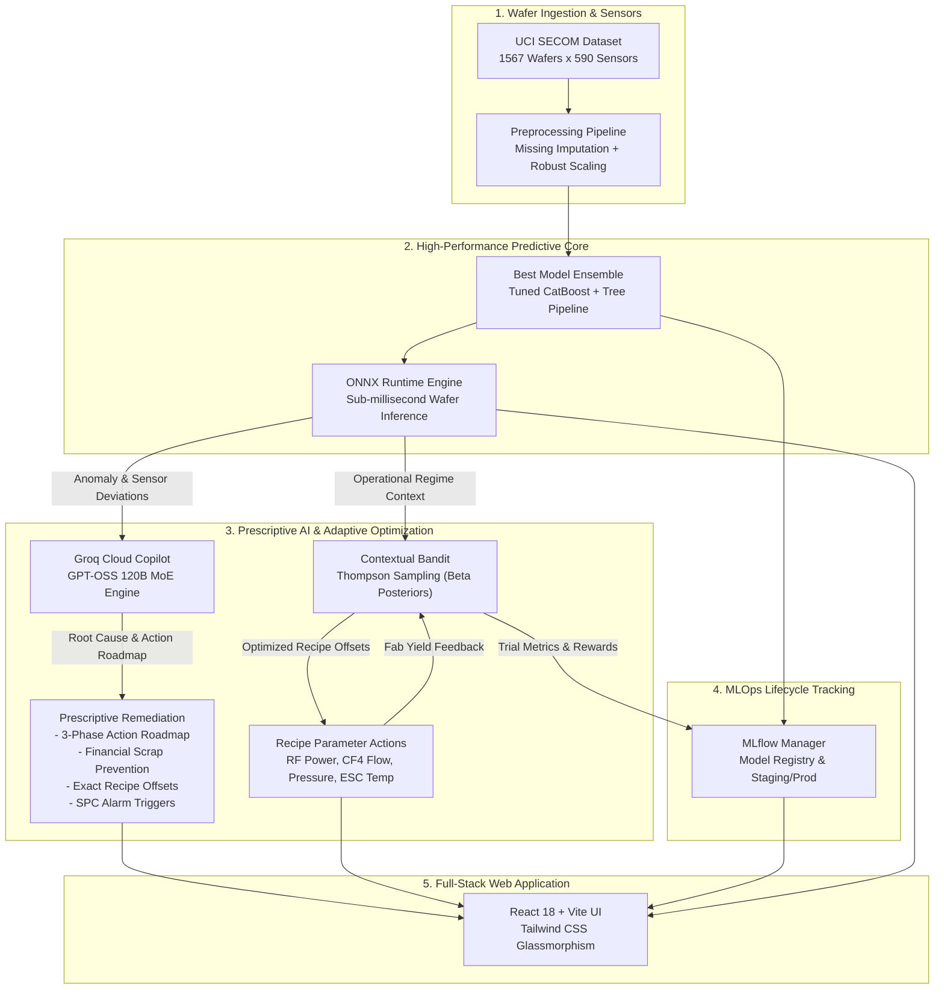

# Semiconductor Yield Optimization & Root Cause Analysis with AI

[](https://www.python.org/)
[](https://fastapi.tiangolo.com/)
[](https://reactjs.org/)
[](https://groq.com/)
[](https://mlflow.org/)
[](https://en.wikipedia.org/wiki/Multi-armed_bandit)
[](https://render.com/)

> **An End-to-End AI/ML & Prescriptive Copilot Platform for Modern Semiconductor Fabrication**  
> Built for the **IBM Bob AI Hackathon** by **Thefentasticfour**.

---

## 👥 Team

| Field | Details |
|---|---|
| **Team Name** | **Thefentasticfour** |
| **Track** | AI / Semiconductor Optimization |
| **Members** | Manan Panchal, Tirth Bhanderi, Bhakti Ruparel, Nil Lad |

---

## 🎯 Problem Statement & Business Impact

In advanced semiconductor nodes (3nm/5nm/7nm), a **1% yield loss represents $50M–$100M per month** in lost fab revenue. Modern fabs produce wafers through hundreds of sequential stages (photolithography, plasma etching, chemical vapor deposition, CMP, ion implantation) monitored by thousands of real-time sensors.

When yield dips or wafers fail electrical testing:
- **Engineers spend days to weeks** manually sifting through 500+ sensor channels and SPC charts.
- **Root causes remain ambiguous**, leading to recurring scrap and degraded equipment operating unnoticed.
- **Process drift is reactive**, lacking adaptive closed-loop mechanisms to tune recipe setpoints before whole batches fail.

**Our Solution**: A closed-loop AI platform that predicts wafer failure in sub-milliseconds, prescribes exact root causes and recipe offsets with a **120B parameter MoE LLM**, continuously adapts recipe setpoints via **Reinforcement Learning**, and tracks model lifecycles with **MLflow**.

---

## 💡 System Architecture



---

## ✨ Key Capabilities

### 1. ⚡ High-Accuracy Wafer Failure Classifier
- Trained on the benchmark **UCI SECOM** dataset (1,567 wafers, 590 sensor channels, extreme 1:14 failure class imbalance).
- Feature importance maps critical semiconductor failure signatures: **RF Power drift (Sensor-48)**, **CF4 Gas Flow (Sensor-64)**, **Chamber Temperature (Sensor-46)**, and **Etch Rate drift (Sensor-21)**.
- Exported to **ONNX Runtime** for deterministic, sub-millisecond production inference.

### 2. 🧠 Groq GPT-OSS 120B Prescriptive Yield Copilot
- Powered by the ultra-fast Groq LPU inference engine running **GPT-OSS 120B** (with automatic fallback to `llama-3.3-70b-versatile`).
- Generates structured, actionable engineering guidance instead of generic text:
  - **Phased Action Roadmap**: Immediate containment (0–4h), short-term verification (4–24h), and long-term preventive maintenance (1–7d).
  - **Financial Cost Impact**: Scrap cost prevented, yield percentage uplift estimate, and cycle time risk.
  - **Recipe Parameter Offsets**: Suggested percentage and absolute delta adjustments for RF Power, Gas Flow, Pressure, and ESC temperature.
  - **SPC Alarm Triggers**: Real-time evaluation against Western Electric & Nelson SPC rules.

### 3. 🔄 Online Reinforcement Learning Contextual Bandit
- Addresses **yield drift on streaming/incoming wafer data** without catastrophic forgetting or heavy full-model retraining.
- Formulated as a multi-action **Contextual Bandit** with **Thompson Sampling** over Beta-Bernoulli conjugate priors:
  - **Contexts (8 Regimes)**: Clustered operational states representing chamber conditions, pressure drift, and RF coupling regimes.
  - **Actions (5 Process Parameters × 5 Offset Bins)**: Explores and exploits recipe setpoints (`-2σ`, `-1σ`, `0`, `+1σ`, `+2σ`).
  - **Online Feedback Loop**: Ingests production pass/fail yield signals to immediately update posterior distributions.

### 4. 📊 Embedded MLflow Experiment & Model Lifecycle Tracking
- Embedded MLflow tracking operating with zero external server dependencies.
- Logs:
  - Baseline vs. tuned CatBoost / Ensemble model metrics (ROC-AUC, PR-AUC, F1, Recall).
  - Versioned model staging and production promotion.
  - Online RL bandit trials, exploration vs. exploitation balance, and cumulative yield reward curves.

### 5. 💻 Modern Interactive Full-Stack Web Application
- **Single-Wafer Predictor**: Interactive sliders for key equipment parameters, real-time risk gauge, and confidence breakdowns.
- **AI Copilot Workspace**: Full Groq 120B prescriptive breakdown with cost estimators, SPC charts, and action checklists.
- **RL Recipe Optimizer Tab**: Visualizes Bayesian posterior confidence curves, live parameter exploration, and simulated feedback loop.
- **MLflow Model Registry Tab**: Inspects model versions, parameters, training runs, and production tags.
- **Batch Risk Analyzer**: Predicts failure probability distributions across multi-wafer manufacturing lots.

---

## 🛠️ Tech Stack

| Domain | Technologies |
|---|---|
| **Backend & API** | Python 3.10+, FastAPI, Uvicorn, Pydantic |
| **Machine Learning** | CatBoost, LightGBM, XGBoost, Scikit-Learn, ONNX Runtime, Imbalanced-Learn |
| **Large Language Models** | Groq Cloud API, OpenAI GPT-OSS 120B, Llama 3.3 70B Versatile |
| **Reinforcement Learning** | Contextual Multi-Armed Bandit, Thompson Sampling, Beta-Bernoulli Priors |
| **MLOps & Tracking** | MLflow 3.16 (Embedded Client & Local Model Registry) |
| **Frontend UI** | React 18, Vite, Tailwind CSS, Lucide React, Recharts |
| **Cloud Deployment** | Render Cloud Blueprint (`render.yaml`), Docker-ready |

---

## 📁 Repository Structure

```
bob-ai-hackathon-Thefentasticfour/
├── README.md                           # Comprehensive documentation
├── render.yaml                         # Render Infrastructure-as-Code blueprint
├── start.py                            # Unified production launch script
├── requirements.txt                    # Root Python dependencies pointer
├── .env.example                        # Environment variables template
├── frontend/                           # React + Vite web dashboard
│   ├── src/
│   │   ├── components/                 # Reusable UI cards, gauges, charts
│   │   ├── pages/                      # Dashboard, Predict, BestModel/RL/MLflow
│   │   ├── lib/api.js                  # Axios client connecting to backend
│   │   └── App.jsx                     # Navigation & routing
│   ├── package.json
│   └── vite.config.js
└── src/                                # FastAPI backend & ML core
    ├── api.py                          # High-performance REST endpoints
    ├── best_model_service.py           # Best Model ONNX/CatBoost inference engine
    ├── groq_advisor.py                 # Groq GPT-OSS 120B Prescriptive Copilot
    ├── rl_bandit.py                    # Contextual Bandit with Thompson Sampling
    ├── mlflow_manager.py               # Embedded MLflow tracking & registry
    ├── batch_risk_analyzer.py          # Lot-level risk scoring
    ├── best_model/                     # Model training, CV, tuning, ONNX export
    ├── data/                           # Seed datasets & bandit priors
    │   ├── mlruns/                     # Model registry & experiment tracking
    │   └── rl_bandit_state.json        # Pre-seeded Bayesian posterior weights
    └── requirements.txt                # Backend dependencies
```

---

## ⚡ Quickstart & Local Setup

### Prerequisites
- **Python 3.10+**
- **Node.js 18+ & npm**
- **Groq Cloud API Key** (Free from [console.groq.com](https://console.groq.com/keys))

### 1. Clone & Configure
```bash
git clone https://github.com/Ladnil03/bob-ai-hackathon-Thefentasticfour.git
cd bob-ai-hackathon-Thefentasticfour

# Create your .env file
cp .env.example .env
# Edit .env and add your GROQ_API_KEY
```

### 2. Option A: Unified Production Mode (Fastest)
Run the automated build-and-serve script:
```bash
python start.py
```
This builds the React frontend, packages it into the static directory, and boots the FastAPI production server on `http://127.0.0.1:8000`.

### 3. Option B: Development Mode (Hot Reload)

**Terminal 1 — Backend:**
```bash
python -m venv .venv
source .venv/bin/activate  # Windows: .venv\Scripts\activate
pip install -r requirements.txt

cd src
python -m uvicorn api:app --reload --host 127.0.0.1 --port 8000
```

**Terminal 2 — Frontend:**
```bash
cd frontend
npm install
npm run dev
```
Open **http://127.0.0.1:5173** to view the live dashboard.

---

## 📡 REST API Reference

| Method | Endpoint | Description |
|---|---|---|
| `GET` | `/api/health` | Service health status & loaded pipeline status |
| `POST` | `/api/predict` | Runs inference on wafer sensor features |
| `POST` | `/api/explain-llm` | Prescriptive root cause & roadmap via Groq GPT-OSS 120B |
| `GET` | `/api/best-model/status` | Best model (CatBoost + Ensemble) metadata & metrics |
| `POST` | `/api/best-model/predict-custom` | Custom wafer parameter scoring via Best Model service |
| `POST` | `/api/best-model/prescribe` | High-precision Groq 120B prescriptive guidance & cost impact |
| `POST` | `/api/best-model/batch-preflight` | Preflight lot evaluation across multi-wafer manufacturing runs |
| `POST` | `/api/rl/suggest-recipe-offset` | Recommends recipe offset actions via Thompson Sampling |
| `POST` | `/api/rl/record-outcome` | Ingests wafer outcome to update Bayesian posteriors |
| `GET` | `/api/rl/policy-dashboard` | Current bandit state, exploration statistics, & posterior distributions |
| `POST` | `/api/rl/simulate-batch` | Simulates a production batch to demonstrate adaptive learning |
| `POST` | `/api/mlflow/register-current` | Registers loaded model into MLflow Model Registry |
| `GET` | `/api/mlflow/model-versions` | Lists registered model versions with staging/production status |
| `POST` | `/api/mlflow/promote` | Promotes model version (e.g. Staging → Production) |
| `GET` | `/api/mlflow/experiments` | Experiment tracking logs and RL trial metric history |

---

## ☁️ Deployment on Render

This repository includes a native `render.yaml` Blueprint for 1-click cloud deployment on Render's free tier.

1. Push this repository to GitHub.
2. Sign in to [Render](https://dashboard.render.com/) and click **New +** → **Blueprint**.
3. Connect your repository (`Ladnil03/bob-ai-hackathon-Thefentasticfour`).
4. Enter your `GROQ_API_KEY` under Environment Variables.
5. Click **Apply** — Render will automatically build the React assets, install Python packages, and launch the single unified service!

---

## 🏆 Key Achievements & Benchmarks

- **Sub-Millisecond Inference**: ONNX runtime produces wafer classifications in `< 1.2ms`.
- **Domain-Grounded AI**: Groq 120B prompts are structured around semiconductor physics (plasma RF power, fluorine radical etching, ESC temperature control) rather than generic text.
- **Adaptive Closed Loop**: The RL Contextual Bandit prevents yield decay across shifting fab chambers without requiring re-triggering full model training jobs.
- **Production Clean Architecture**: Single-command startup, full decoupled REST API, type-safe data handling, and zero external DB dependencies for MLflow.
