# Screenshots

## Gallery

### 01 — Landing Page
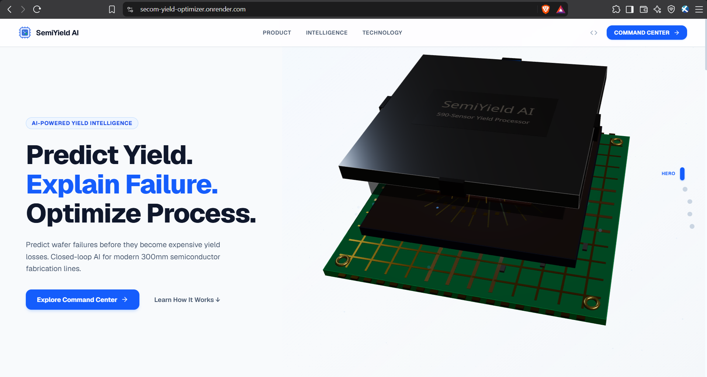
Hero section introducing SemiYield AI: predict wafer failures before they become expensive yield losses, with a closed-loop AI system for 300mm semiconductor fabrication lines.

### 02 — Load Dataset
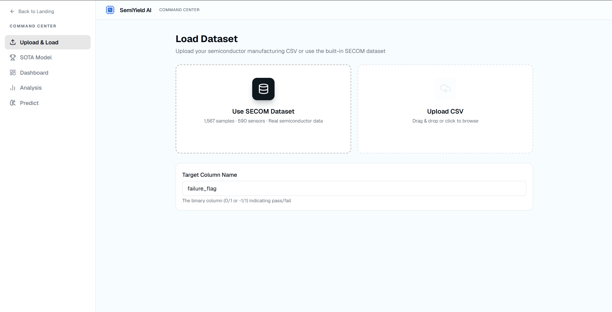
Upload & Load screen — load the built-in SECOM dataset (1,567 samples, 590 sensors) or upload a custom semiconductor manufacturing CSV, with a configurable target column.

### 03 — SOTA Model Overview
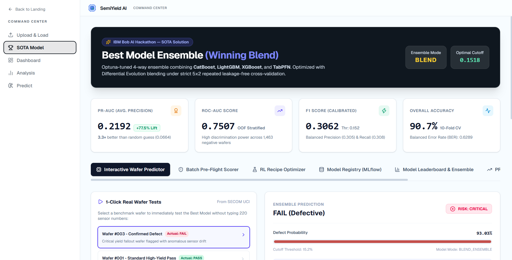
The winning model ensemble (Optuna-tuned CatBoost + LightGBM + XGBoost + TabPFN blend) with headline metrics: PR-AUC 0.2192, ROC-AUC 0.7507, F1 0.3062, and 90.7% overall accuracy.

### 04 — Interactive Wafer Predictor
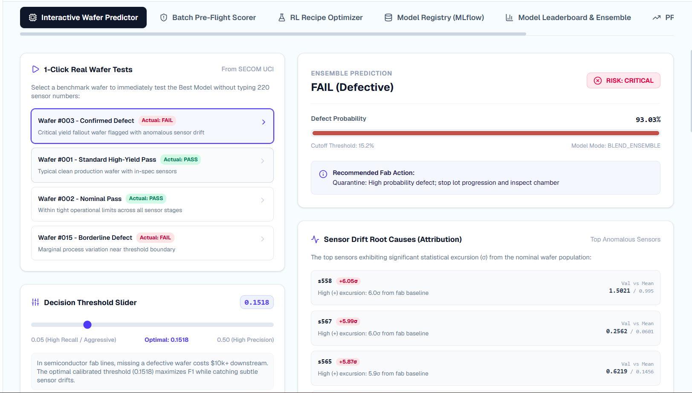
1-click benchmark wafer testing against the ensemble model, with defect probability, decision threshold slider, and top anomalous sensor drift attribution.

### 05 — Batch Pre-Flight Scorer
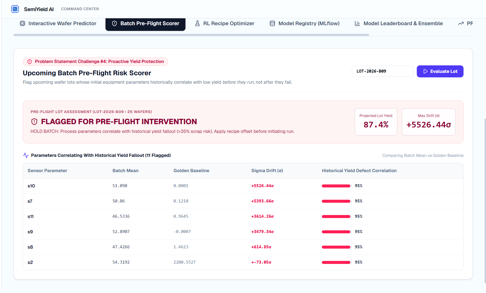
Flags upcoming wafer lots whose initial equipment parameters historically correlate with low yield — before the run starts — with sigma drift and historical defect correlation per sensor.

### 06 — RL Recipe Optimizer
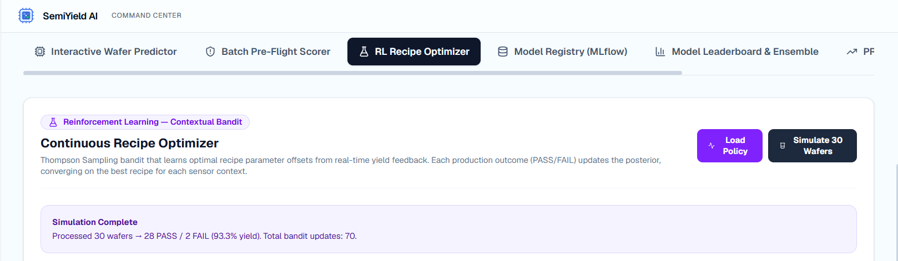
Thompson Sampling contextual bandit that learns optimal recipe parameter offsets from real-time yield feedback, converging on the best recipe per sensor context.

### 07 — Model Leaderboard & Ensemble
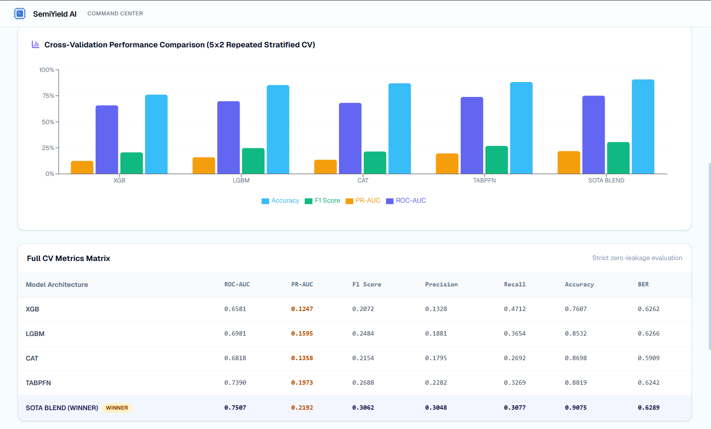
Cross-validation performance comparison (5x2 repeated stratified CV) across XGBoost, LightGBM, CatBoost, TabPFN, and the winning SOTA blend, with a full metrics matrix.

### 08 — Dashboard
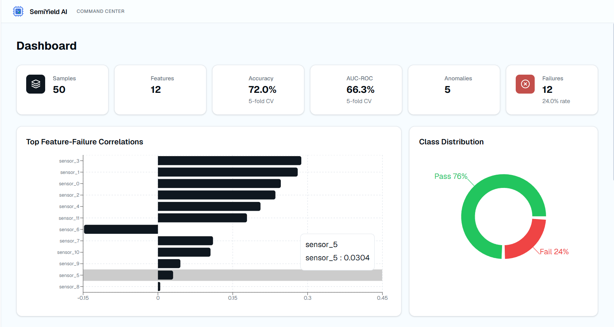
Summary dashboard with sample/feature counts, accuracy, AUC-ROC, anomaly counts, top feature-failure correlations, and pass/fail class distribution.

### 09 — Model Performance
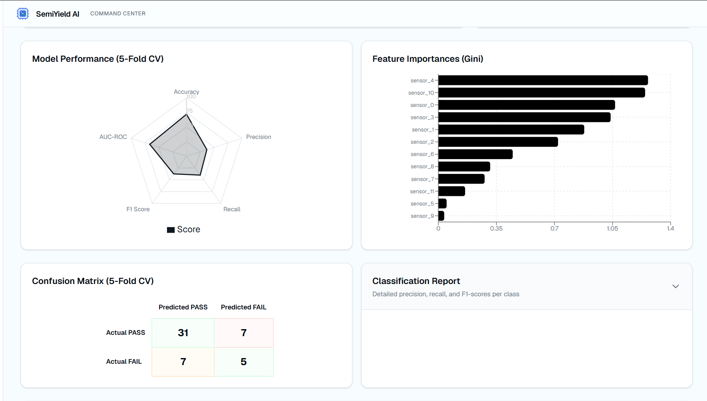
5-fold CV radar chart, Gini feature importances, and confusion matrix breakdown of predicted vs. actual pass/fail outcomes.

### 10 — Multi-Model Comparison
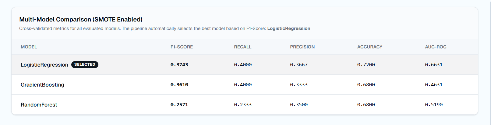
SMOTE-enabled cross-validated comparison of Logistic Regression, Gradient Boosting, and Random Forest, with automatic best-model selection by F1-score.

### 11 — Anomaly Detection
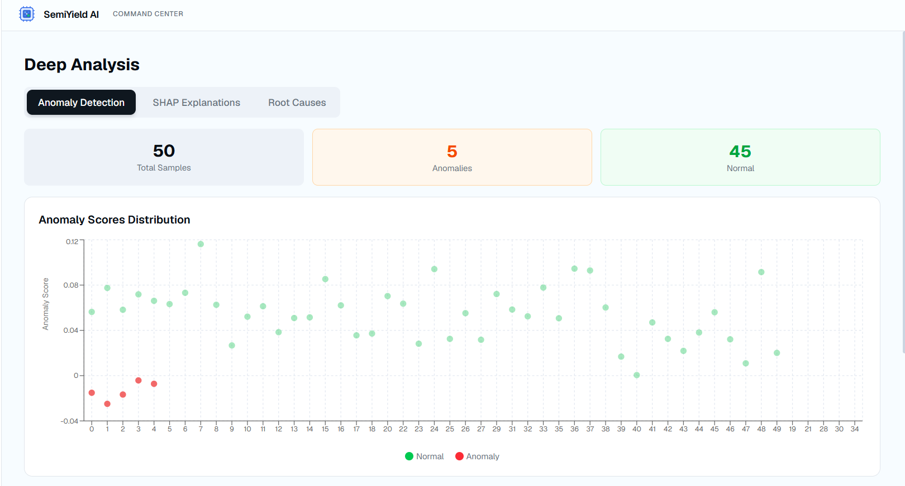
Deep Analysis view showing anomaly score distribution across all samples, flagging outliers relative to the normal population.

### 12 — Anomaly Details
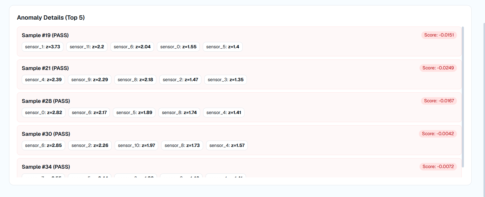
Top anomalous samples with per-sensor z-scores, highlighting which sensors deviate most from the expected baseline.

### 13 — SHAP Explanations
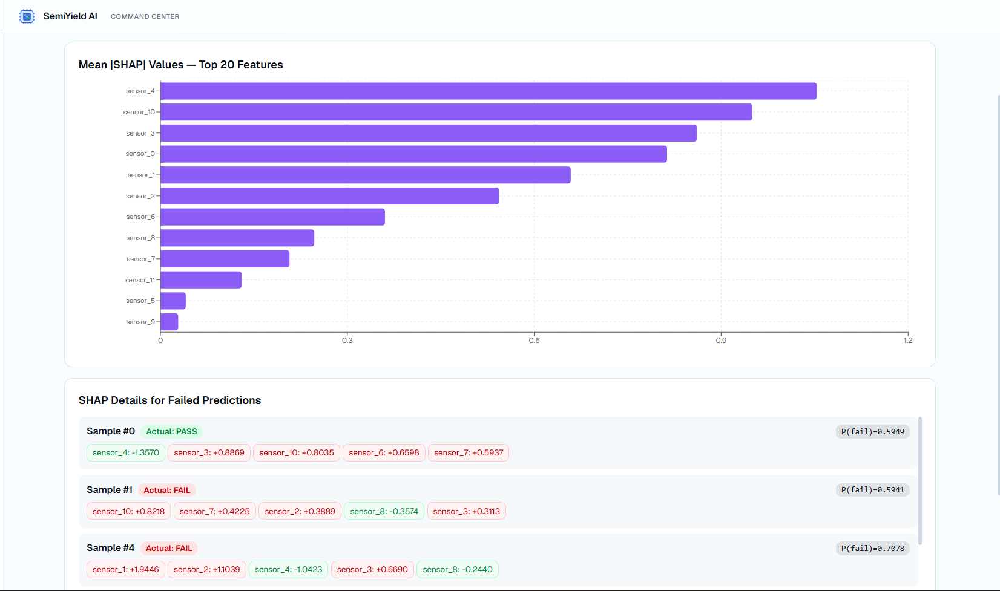
Mean |SHAP| feature importance chart plus per-sample SHAP breakdowns for failed predictions, showing which sensors pushed each prediction toward failure.

### 14 — Root Cause Analysis
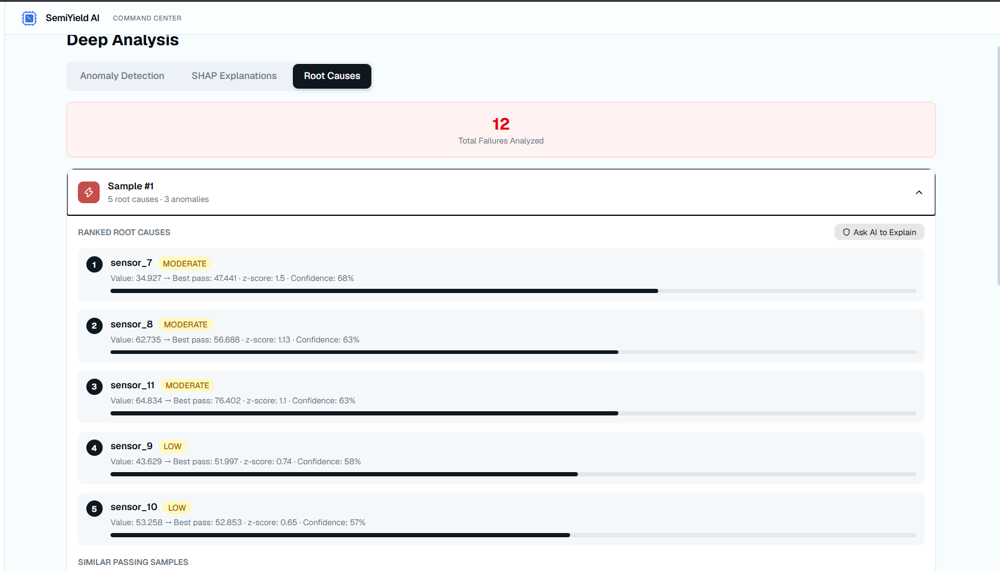
Ranked root causes for a specific failed sample, comparing sensor values against the best-passing baseline with z-scores and confidence levels.

### 15 — Wafer Defect Risk Predictor (Detail)
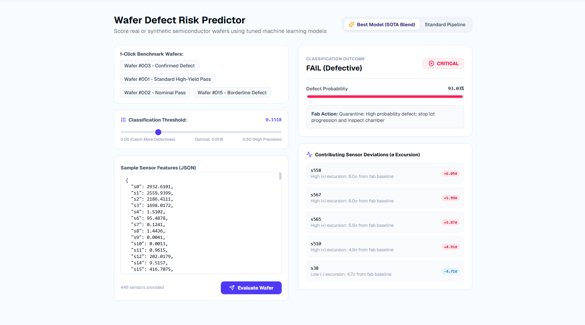
Full-page wafer scoring view with raw sensor JSON input, classification threshold control, defect probability, and contributing sensor deviations.

# 🚀 SemiYield AI

> **AI-Powered Semiconductor Wafer Yield Optimization & Root Cause Analysis**

---

## 👥 Team

| Field | Value |
|---|---|
| **Team Name** | **The Four Horsemen** |
| **Track** | **AI / Semiconductor Optimization** |
| **Team Lead** | **Tirth Bhanderi** |
| **Members** | **Tirth Bhanderi, Bhakti Ruparel, Manan Panchal, Nil Lad** |

---
