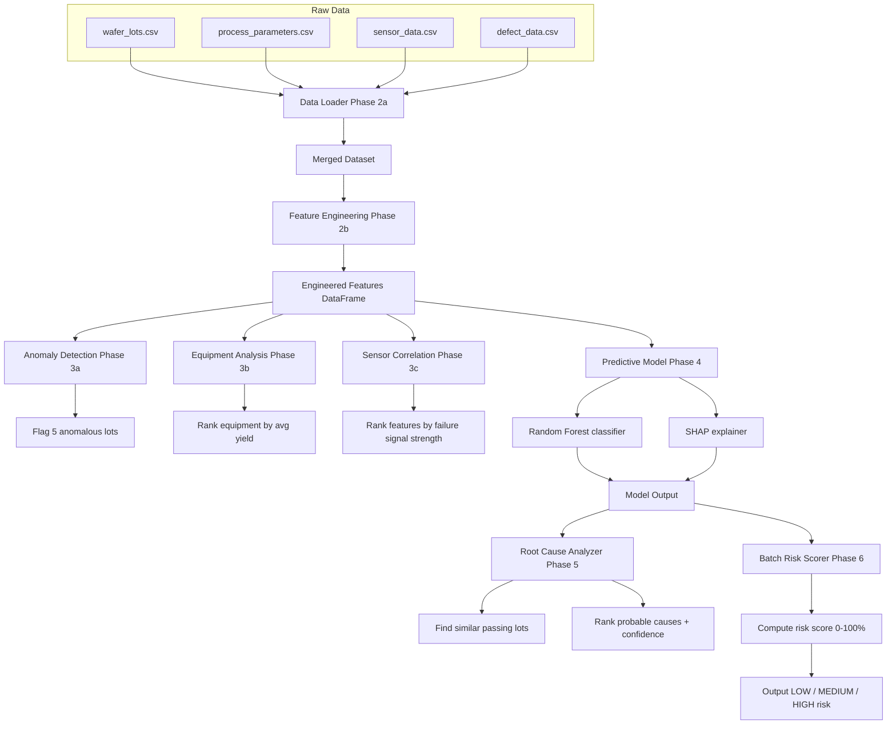

# System Architecture

## Data Flow Diagram

## Key Modules

| Module | Purpose | LOC |
|--------|---------|-----|
| `data_loader.py` | Load & merge 4 CSVs | 192 |
| `feature_engineering.py` | Sensor aggregation, feature extraction | 195 |
| `anomaly_detection.py` | Isolation Forest, correlation analysis | 247 |
| `predictive_model.py` | Random Forest, SHAP, model training | 260 |
| `root_cause_analyzer.py` | Root cause ranking, explanations | 300 |
| `app.py` | Pipeline orchestration, batch scoring | 305 |

## Data Transformations

1. **Raw Sensors** (180 rows of 5-min readings)
   → Aggregate by lot
   → **10 engineered features** (drift, std, max values)

2. **Defects** (150 defect records)
   → Count by type per lot
   → **5 aggregated defect features**

3. **Parameters** (30 recipe rows)
   → Merge on lot_id
   → **12 target parameters**

4. **Final Dataset**: 30 rows × 47 features
